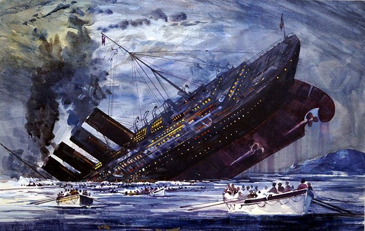

# Titanic Shipwreck Survival Prediction from Kaggle Dataset

Overview
The Titanic shipwreck was one of the most infamous maritime disasters in history. On April 15, 1912, the Titanic sank after striking an iceberg during her maiden voyage, killing 1,502 people.

This dataset contains information about the passengers and crew on the Titanic, including their age, gender, social class, and whether they survived the shipwreck. The goal of this project is to use machine learning to predict which passengers were likely to survive.

Dataset
The dataset is available on Kaggle: Titanic: Machine Learning from Disaster: https://www.kaggle.com/c/titanic

The dataset contains the following features:

PassengerId: A unique identifier for each passenger
Survived: Whether the passenger survived the shipwreck (1 = survived, 0 = died)
Pclass: The passenger's social class (1 = upper class, 2 = middle class, 3 = lower class)
Name: The passenger's name
Sex: The passenger's sex (male or female)
Age: The passenger's age
SibSp: The number of siblings and spouses the passenger had on board
Parch: The number of parents and children the passenger had on board
Ticket: The passenger's ticket number
Fare: The price the passenger paid for their ticket
Cabin: The passenger's cabin number
Embarked: The port where the passenger embarked (S = Southampton, C = Cherbourg, Q = Queenstown)
Preprocessing
Before training a machine learning model, it is important to preprocess the data. This may involve the following steps:

Handling missing values: Some of the features in the dataset contain missing values. These values can be handled by imputing them with a reasonable value, such as the mean or median value for that feature.
Encoding categorical features: Some of the features in the dataset are categorical, such as Pclass, Sex, and Embarked. These features need to be encoded before they can be used by a machine learning model. One way to encode categorical features is to use one-hot encoding. This involves creating a new binary feature for each category.
Scaling numerical features: It is also important to scale numerical features so that they are all on the same scale. This can be done using a technique such as min-max scaling or standard scaling.
Feature engineering
In addition to preprocessing the data, it may also be helpful to engineer new features. This involves creating new features from existing features that may be more informative for the machine learning model.

For example, one might create a new feature called "AgeCategory" by grouping passengers into different age categories (e.g., child, adult, senior). Another example might be to create a new feature called "FamilySize" by adding together the number of siblings and spouses and the number of parents and children.

Model training
Once the data has been preprocessed and engineered, a machine learning model can be trained. There are many different machine learning algorithms that can be used for this task. Some popular algorithms include logistic regression, random forests, and gradient boosting machines.

Evaluation
Once a model has been trained, it is important to evaluate its performance on a held-out test set. This will give you an idea of how well the model will generalize to new data.

One way to evaluate a model is to calculate its accuracy. This is the percentage of passengers that the model correctly predicts whether they survived or died.

Another way to evaluate a model is to calculate its AUC score. This is a measure of how well the model is at ranking passengers by their probability of survival.

Conclusion
This project aims to use machine learning to predict which passengers on the Titanic were likely to survive. By using machine learning to develop a more accurate understanding of the factors that contributed to survival, we can improve safety standards for future maritime travel.

Additional tips
Use cross-validation: Cross-validation is a technique that can be used to prevent overfitting. It involves dividing the training data into multiple folds and training the model on each fold separately. The model's performance on the folds it was not trained on is then used to estimate its generalization performance.
Use a variety of features: The more features you use, the more information the model will have to learn from. However, it is important to avoid using too many features, as this can lead to overfitting.
Tune the hyperparameters of your model: Hyperparameters are parameters that control the behavior of the machine learning algorithm. Different algorithms have different hyperparameters. It is important to tune the hyperparameters of your model to achieve optimal performance.
Resources
Titanic: Machine Learning from Disaster: https://www.kaggle.com/c/titanic
[Machine Learning
  
